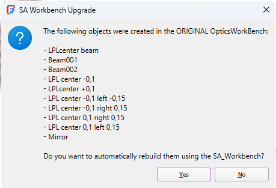
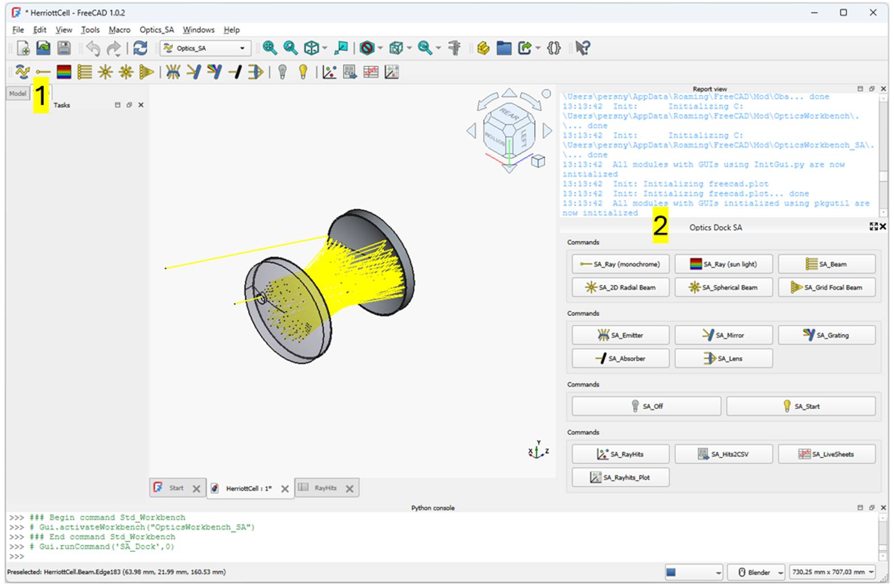
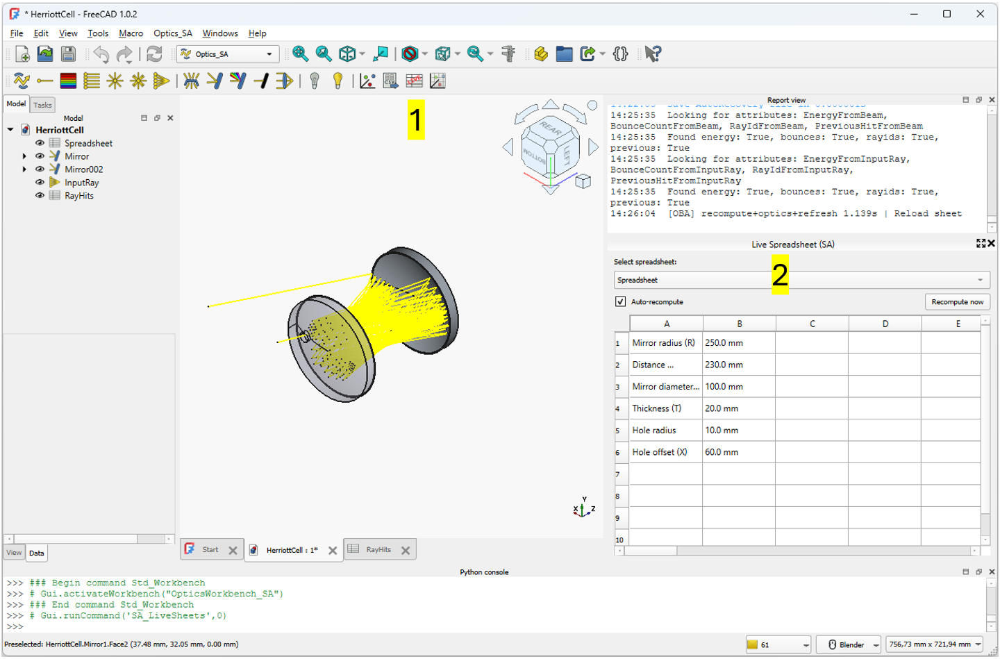
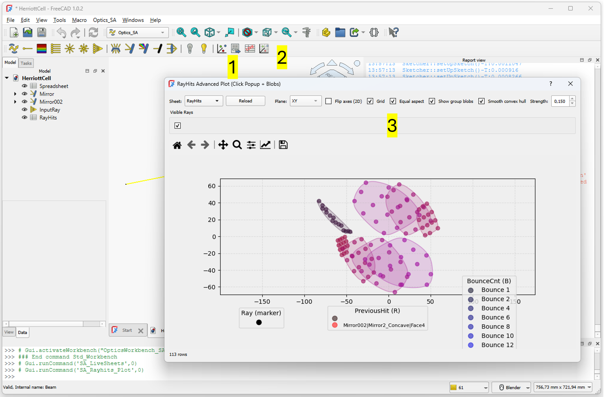
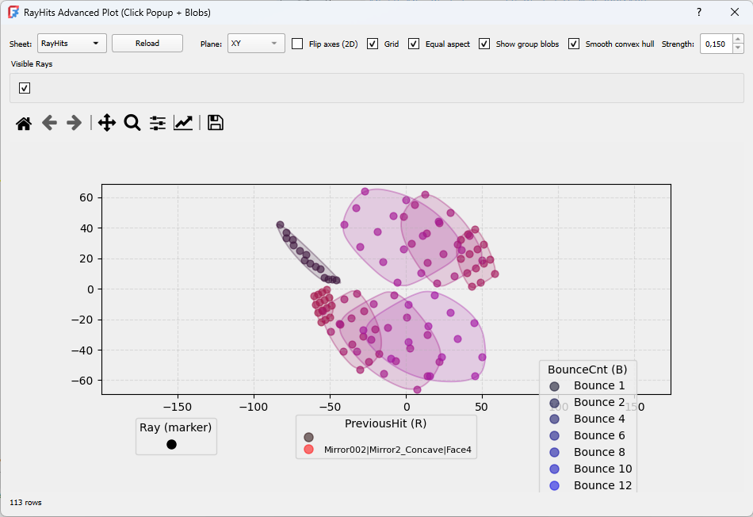
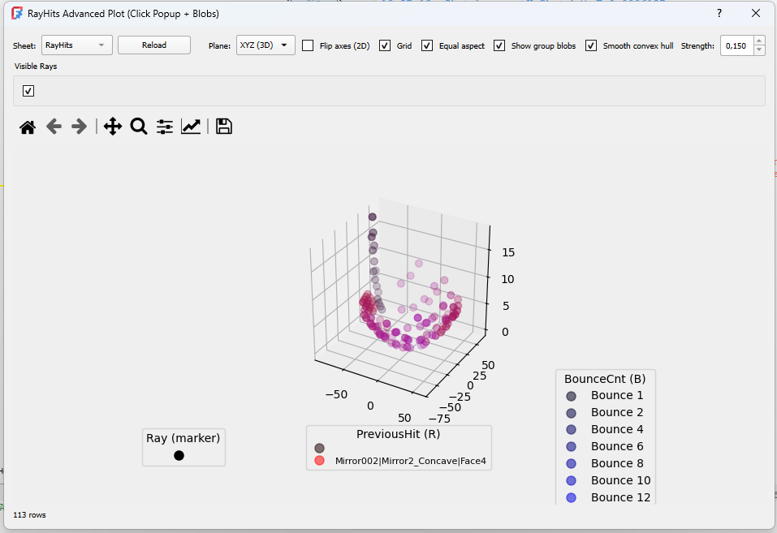

##  Optics Workbench_SA v0.9

### What is this ?
This is an experimental workbench built on top of chbergmann’s amazing OpticalWorkbench:  
[https://github.com/chbergmann/OpticsWorkbench]

Without his work, this bench wouldn’t even exist.

**This version is highly experimental**, and several features may be incomplete, unstable, or even temporarily broken.  
It is developed to support very specific use‑cases that are not covered by the official release.

For maximum stability and reliability, **the official OpticalWorkbench is strongly recommended**, and this project should be considered an optional add‑on for users who need advanced or unconventional functionality.

The intention is not to replace or take credit for the original project in any way, but rather to extend it for special workflows while acknowledging and respecting the original author’s work.


## 🔧 Installation

To install, copy the content into FreeCAD’s Mod folder.
Typical location on Windows:

```
C:\Users\<username>\AppData\Roaming\FreeCAD\Mod\
```

### 📂 Working With Existing Projects

If you open a FreeCAD file that was created with the original OpticalWorkbench, the optical objects inside it will not match the structure used by this experimental SA‑version.
This add‑on introduces new properties, extended ray‑statistics, different proxy classes, and updated internal logic.
Because FreeCAD does not automatically upgrade existing FeaturePython objects, legacy objects must be converted before they can be used reliably.
When such a file is detected, the SA‑Workbench displays a warning indicating which objects were created in another workbench.


### 🔄 Conversion Process

Converting a legacy project is straightforward:


#### 1. Click the “Restart All / Check Objects” button    


This scans the active FreeCAD document and produces a dialog listing all objects that were originally created using the **old OpticsWorkbench**.

The dialog clearly identifies legacy objects such as beams, lenses, mirrors, or LPL elements that must be rebuilt to operate correctly under the new SA‑Workbench.


The dialog clearly identifies legacy objects such as beams, lenses, mirrors, or LPL elements that must be rebuilt to operate correctly under the new SA‑Workbench.

 


- New SA‑compatible objects are created in their place  
- All relevant parameters are transferred, including:  
  - transparency  
  - base geometry  
  - material settings  
  - lens data  
  - and more  

Selecting **Yes** automatically rebuilds all incompatible objects using the **SA‑Workbench**.


> **Note:**  
> Object names may not be fully preserved during the conversion.  
> In some cases, the original name cannot be transferred and the SA‑Workbench assigns a new standardized name instead.

### 🔔 Direction System Update (SA‑version)
The SA‑Workbench introduces a revised ray‑direction standard:

- All rays now start along the +Z axis by default
- The final physical direction is always controlled by Placement.Rotation → Euler (Z‑Y‑X)
- This provides consistent behaviour for focal, cone, beam, and 3D bundles

Impact on existing workflows
Legacy OpticsWorkbench examples were based on +X as the initial ray axis.
Therefore:
#### 👉 Imported or copied examples will not automatically match the original orientation.
#### 👉 Users must manually adjust the ray Placement/Rotation when recreating older setups.
The SA‑Workbench does not attempt to auto‑convert these directions,
because in many optical layouts the intended rotation is user‑specific.
### Summary

- Default base direction is now (0, 0, 1)
- Rotation fully defines actual ray direction
- When rebuilding older examples, the user may need to adjust the rotation to match the previous behaviour


---


### Added features 

Pictures shown are taken from the included Herriott Cell example:
**Tollbar → Optics_SA → Herriott Cell Example**

---

##  Dock
---
By clicking this button (1) in the toolbar, you open a dedicated command dock (2) that remains visible even when you switch to another workbench.



The purpose of the Command Dock is to give quick access to the most frequently used Optics Workbench SA commands without requiring you to constantly switch back and forth between workbenches. This is especially useful in workflows where optical operations need to be combined with modeling, sketching, or data inspection tools from other workbenches.


##  Livesheet
---
The LiveSheet tool adds a simple spreadsheet dock that can be kept open alongside other workbenches.
Its purpose is mainly convenience: it lets you inspect and edit spreadsheet data without switching views or opening the full Spreadsheet editor.
LiveSheet can also trigger recomputation after each edit, which may be useful in setups where spreadsheet values drive optical parameters.
However, it is intended as a lightweight helper rather than a replacement for FreeCAD’s built‑in spreadsheet tools or the mechanisms already provided by the original Optics Workbench.
Typical uses include:

- Adjusting a few parameters while keeping the 3D view visible
- Quickly checking values during optical experimentation
- Avoiding frequent window switching during combined CAD/optics workflows




##  RayHits Advanced Plot
---
RayHits Advanced Plot is an interactive visualization tool for FreeCAD, designed for ray‑tracing and geometrical acoustics workflows where simulation results are stored in Spreadsheet sheets.
This version includes:


- Click‑to‑inspect points (popup with full metadata)
- Transparent cluster‑blobs based on convex hulls, adaptive offsets, and smoothing
- Toggleable blob visibility
- Switchable XY / XZ / YZ / 3D view modes
- Customizable axes, grids, and aspect ratio
- Automatic color‑mixing based on PreviousHit (R) and BounceCnt (B)
- Per‑Ray visibility checkboxes

### 🚀 Starting the Plot

#### 1) Create the RayHits spreadsheet
Click the “Ray Hits Export” button: 
This generates the Spreadsheet sheets (RayHits, PreviousHit, BounceCount, …) used by the plotter.

#### 2) Open the Advanced Plot

Press the RayHits Advanced Plot button:  

This opens the interactive plotting window.



---

#### 🎛️ What You Can Do With the Plot
The RayHits Advanced Plot provides a rich set of tools for inspecting and understanding ray‑tracing data. Here is an overview of what you can do:
#### 🔍 Inspect individual points

Click any plotted point to view a popup containing:

- Ray name
- Hit ID
- PreviousHit
- Bounce count
- 3D coordinates (X, Y, Z)
- Energy

Perfect for debugging ray interactions or analyzing acoustic/optical propagation.

### 📦 Visualize cluster‑blobs

Each (Ray, PreviousHit, BounceCnt) group can generate a transparent colored blob.
Blobs use:

- Convex hull generation
- Adaptive outward offset
- Optional smooth blending (Chaikin-like)


Blobs help you understand spatial grouping, reflections, and scattering structure.

### 🎨 Color‑encode physical meaning

- Red component = PreviousHit
- Blue component = BounceCnt
- Transparency added for depth and grouping
- Legend panels show the mapping

This creates a meaningful and consistent color space for ray interaction paths.

### 📐 Switch coordinate planes
Choose:

- XY
- XZ
- YZ
- Full 3D

Useful for studying ray behavior relative to geometry.


### 🔄 Flip axes
Optional axis‑flip mode, particularly helpful when comparing with external tools or optical coordinate systems.






